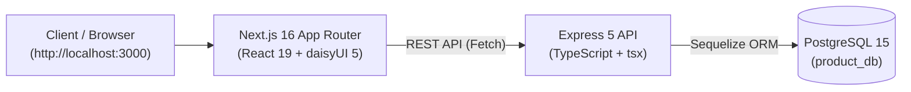

# Fullstack Project Setup & Creation Guide
*Express 5 + TypeScript + PostgreSQL (Backend) & Next.js 16 + React 19 + Tailwind v4 + daisyUI 5 (Frontend)*

---

## 1. Project Architecture Overview

This project consists of a containerized fullstack web application with three decoupled layers:

1. **Frontend**: Next.js 16 (App Router), React 19, Tailwind CSS v4, daisyUI 5, Lucide Icons.
2. **Backend API**: Express 5, TypeScript, Sequelize ORM v6, RESTful endpoints.
3. **Database**: PostgreSQL 15 Alpine running in an isolated Docker container with automated health checks.



---

## 2. Prerequisites

Ensure you have the following installed on your host machine:

- **Node.js**: v20.x or v22.x LTS
- **npm** (for Backend): v10+
- **pnpm** (for Frontend): v9+ or v11+
- **Docker & Docker Compose**: Compose v2+

---

## 3. How to Create & Set Up the Backend From Scratch

### Step 1: Initialize the Project & Directory
```bash
mkdir backend
cd backend
npm init -y
```

### Step 2: Install Dependencies
```bash
# Production dependencies
npm install express@^5.0.0 sequelize@^6.37.0 pg@^8.23.0 cors@^2.8.5 dotenv@^17.4.0

# Development dependencies & TypeScript
npm install -D typescript @types/node @types/express @types/cors @types/pg @types/dotenv tsx ts-node
```

### Step 3: Configure TypeScript (`tsconfig.json`)
Create `backend/tsconfig.json`:
```json
{
  "compilerOptions": {
    "target": "ES2022",
    "module": "CommonJS",
    "moduleResolution": "node",
    "rootDir": "./src",
    "outDir": "./dist",
    "strict": true,
    "esModuleInterop": true,
    "skipLibCheck": true,
    "forceConsistentCasingInFileNames": true
  },
  "include": ["src/**/*"]
}
```

### Step 4: Configure NPM Scripts (`package.json`)
```json
"scripts": {
  "build": "tsc",
  "dev": "tsx watch src/server.ts",
  "start": "node dist/server.js",
  "seed": "tsx src/seed.ts"
}
```

### Step 5: Directory Structure
```
backend/
├── src/
│   ├── config/
│   │   └── database.ts        # Sequelize database connection instance
│   ├── controllers/
│   │   └── productController.ts # HTTP handlers & business logic
│   ├── middleware/
│   │   └── errorHandler.ts    # Global error interceptor
│   ├── models/
│   │   └── Product.ts         # Model definition & table schema
│   ├── routes/
│   │   └── productRoutes.ts   # Route definitions
│   ├── seeders/
│   │   └── productSeeder.ts   # Seed mock data generator
│   ├── seed.ts                # Seeder execution script
│   └── server.ts              # App bootstrap & port listener
├── .env.example
├── Dockerfile
├── package.json
└── tsconfig.json
```

### Step 6: Database Connection (`src/config/database.ts`)
```typescript
import { Sequelize } from 'sequelize';
import dotenv from 'dotenv';

dotenv.config();

export const sequelize = new Sequelize(
  process.env.POSTGRES_DB || 'product_db',
  process.env.POSTGRES_USER || 'postgres',
  process.env.POSTGRES_PASSWORD || 'postgres',
  {
    host: process.env.POSTGRES_HOST || 'localhost',
    port: parseInt(process.env.POSTGRES_PORT || '5432', 10),
    dialect: 'postgres',
    logging: process.env.DB_LOGGING === 'true' ? console.log : false,
    pool: {
      max: 10,
      min: 0,
      acquire: 30000,
      idle: 10000
    }
  }
);
```

### Step 7: Define Model (`src/models/Product.ts`)
```typescript
import { Model, DataTypes } from 'sequelize';
import { sequelize } from '../config/database';

export class Product extends Model {
  public id!: number;
  public name!: string;
  public description!: string;
  public price!: number;
  public category!: string;
  public stock!: number;
  public sku!: string;
  public imageUrl!: string;
  public isActive!: boolean;
}

Product.init(
  {
    id: { type: DataTypes.INTEGER, autoIncrement: true, primaryKey: true },
    name: { type: DataTypes.STRING(255), allowNull: false },
    description: { type: DataTypes.TEXT, allowNull: true },
    price: { type: DataTypes.FLOAT, allowNull: false },
    category: { type: DataTypes.STRING(100), allowNull: false },
    stock: { type: DataTypes.INTEGER, allowNull: false, defaultValue: 0 },
    sku: { type: DataTypes.STRING(50), allowNull: true, unique: true },
    imageUrl: { type: DataTypes.STRING(1024), allowNull: true },
    isActive: { type: DataTypes.BOOLEAN, allowNull: false, defaultValue: true },
  },
  {
    sequelize,
    tableName: 'products',
    timestamps: true,
  }
);
```

### Step 8: Bootstrap Server (`src/server.ts`)
```typescript
import express from 'express';
import cors from 'cors';
import dotenv from 'dotenv';
import { sequelize } from './config/database';
import productRoutes from './routes/productRoutes';
import { errorHandler } from './middleware/errorHandler';

dotenv.config();

const app = express();
const PORT = process.env.PORT || 5001;

app.use(cors({ origin: process.env.CORS_ORIGIN || '*' }));
app.use(express.json());

app.use('/api/products', productRoutes);

app.get('/api/health', async (_req, res) => {
  try {
    await sequelize.authenticate();
    res.json({ status: 'ok', database: 'connected', timestamp: new Date() });
  } catch (error: any) {
    res.status(503).json({ status: 'degraded', database: 'disconnected', error: error.message });
  }
});

app.use(errorHandler);

sequelize.sync().then(() => {
  app.listen(PORT, () => {
    console.log(`Backend server running on http://localhost:${PORT}`);
  });
}).catch((err) => {
  console.error('Database connection error:', err);
});
```

---

## 4. How to Create & Set Up the Frontend From Scratch

### Step 1: Scaffold Next.js 16
```bash
pnpm create next-app frontend --typescript --eslint --app --src-dir=false --import-alias="@/*"
cd frontend
```

### Step 2: Install Styling & Icon Dependencies
```bash
pnpm install daisyui@^5.0.0 lucide-react@^1.46.0
pnpm install -D tailwindcss@^4 @tailwindcss/postcss postcss
```

### Step 3: Configure Tailwind CSS v4 & daisyUI
In Next.js with Tailwind v4, styles are imported cleanly in `app/globals.css`:
```css
@import "tailwindcss";
@plugin "daisyui" {
  themes: light --default, dark --prefersdark;
}
```

Configure `frontend/postcss.config.mjs`:
```javascript
export default {
  plugins: {
    "@tailwindcss/postcss": {},
  },
};
```

### Step 4: Directory Structure
```
frontend/
├── app/
│   ├── globals.css         # Tailwind v4 import & daisyUI plugin
│   ├── layout.tsx          # Root shell, HTML data-theme, Navbar
│   └── page.tsx            # Interactive Dashboard View
├── components/
│   ├── AnalyticsCards.tsx  # KPI cards (Stock, Valuation, Counts)
│   ├── FilterBar.tsx       # Search bar, category filter, sort dropdown
│   ├── ProductCard.tsx     # Responsive grid view cards
│   ├── ProductTable.tsx    # Compact table view
│   ├── ProductModal.tsx    # Create/Edit product dialog
│   └── Toast.tsx           # Success/Error notification alerts
├── services/
│   └── api.ts              # Typed API communication service
├── types/
│   └── product.ts          # Shared TypeScript interfaces
├── .env.example
├── .env.local
├── package.json
└── tsconfig.json
```

### Step 5: Connect to Backend API (`services/api.ts`)
```typescript
import { Product, ProductInput, DashboardStats } from '@/types/product';

const API_BASE = process.env.NEXT_PUBLIC_API_URL || 'http://localhost:5001/api';

export const productApi = {
  async getAll(params?: Record<string, string>): Promise<Product[]> {
    const query = params ? '?' + new URLSearchParams(params).toString() : '';
    const res = await fetch(`${API_BASE}/products${query}`);
    if (!res.ok) throw new Error('Failed to fetch products');
    const result = await res.json();
    return result.data || result;
  },

  async create(data: ProductInput): Promise<Product> {
    const res = await fetch(`${API_BASE}/products`, {
      method: 'POST',
      headers: { 'Content-Type': 'application/json' },
      body: JSON.stringify(data),
    });
    if (!res.ok) throw new Error('Failed to create product');
    const result = await res.json();
    return result.data || result;
  },

  async update(id: number, data: Partial<ProductInput>): Promise<Product> {
    const res = await fetch(`${API_BASE}/products/${id}`, {
      method: 'PUT',
      headers: { 'Content-Type': 'application/json' },
      body: JSON.stringify(data),
    });
    if (!res.ok) throw new Error('Failed to update product');
    const result = await res.json();
    return result.data || result;
  },

  async delete(id: number): Promise<void> {
    const res = await fetch(`${API_BASE}/products/${id}`, { method: 'DELETE' });
    if (!res.ok) throw new Error('Failed to delete product');
  },

  async getStats(): Promise<DashboardStats> {
    const res = await fetch(`${API_BASE}/products/stats/summary`);
    if (!res.ok) throw new Error('Failed to fetch statistics');
    const result = await res.json();
    return result.data || result;
  },

  async checkHealth(): Promise<boolean> {
    try {
      const res = await fetch(`${API_BASE}/health`, { cache: 'no-store' });
      return res.ok;
    } catch {
      return false;
    }
  }
};
```

---

## 5. Docker Orchestration (`docker-compose.yml`)

The root `docker-compose.yml` ties the entire stack together:

```yaml
services:
  product-db:
    image: postgres:15-alpine
    container_name: product-db
    restart: unless-stopped
    environment:
      POSTGRES_USER: ${POSTGRES_USER:-postgres}
      POSTGRES_PASSWORD: ${POSTGRES_PASSWORD:-postgres}
      POSTGRES_DB: ${POSTGRES_DB:-product_db}
    ports:
      - "${POSTGRES_PORT:-5433}:5432"
    volumes:
      - product-db-data:/var/lib/postgresql/data
    networks:
      - product-network
    healthcheck:
      test: ["CMD-SHELL", "pg_isready -U ${POSTGRES_USER:-postgres} -d ${POSTGRES_DB:-product_db}"]
      interval: 10s
      timeout: 5s
      retries: 5

  backend:
    build:
      context: ./backend
      dockerfile: Dockerfile
    container_name: product-backend
    restart: unless-stopped
    environment:
      PORT: ${PORT:-5001}
      NODE_ENV: ${NODE_ENV:-development}
      POSTGRES_HOST: product-db
      POSTGRES_PORT: 5432
      POSTGRES_USER: ${POSTGRES_USER:-postgres}
      POSTGRES_PASSWORD: ${POSTGRES_PASSWORD:-postgres}
      POSTGRES_DB: ${POSTGRES_DB:-product_db}
    ports:
      - "${PORT:-5001}:5001"
    volumes:
      - ./backend:/app
      - /app/node_modules
    depends_on:
      product-db:
        condition: service_healthy
    networks:
      - product-network

  frontend:
    build:
      context: ./frontend
      dockerfile: Dockerfile
    container_name: product-frontend
    restart: unless-stopped
    environment:
      NEXT_PUBLIC_API_URL: http://localhost:5001/api
    ports:
      - "3000:3000"
    volumes:
      - ./frontend:/app
      - /app/node_modules
      - /app/.next
    depends_on:
      - backend
    networks:
      - product-network

volumes:
  product-db-data:

networks:
  product-network:
    driver: bridge
```

---

## 6. How to Run the Application

### Option 1: Docker (Single Command)
```bash
# Build and run the entire stack
docker compose up --build -d

# Seed the database with sample products
docker compose exec backend npm run seed
```

Endpoints:
- **Frontend UI**: [http://localhost:3000](http://localhost:3000)
- **Backend API**: [http://localhost:5001/api](http://localhost:5001/api)
- **Health Check**: [http://localhost:5001/api/health](http://localhost:5001/api/health)
- **PostgreSQL**: `localhost:5433`

### Option 2: Local Development (Without Docker for Node)
```bash
# 1. Start PostgreSQL
docker compose up product-db -d

# 2. Run Backend
cd backend
npm install
npm run dev
npm run seed

# 3. Run Frontend (in a new terminal)
cd frontend
pnpm install
pnpm dev
```
