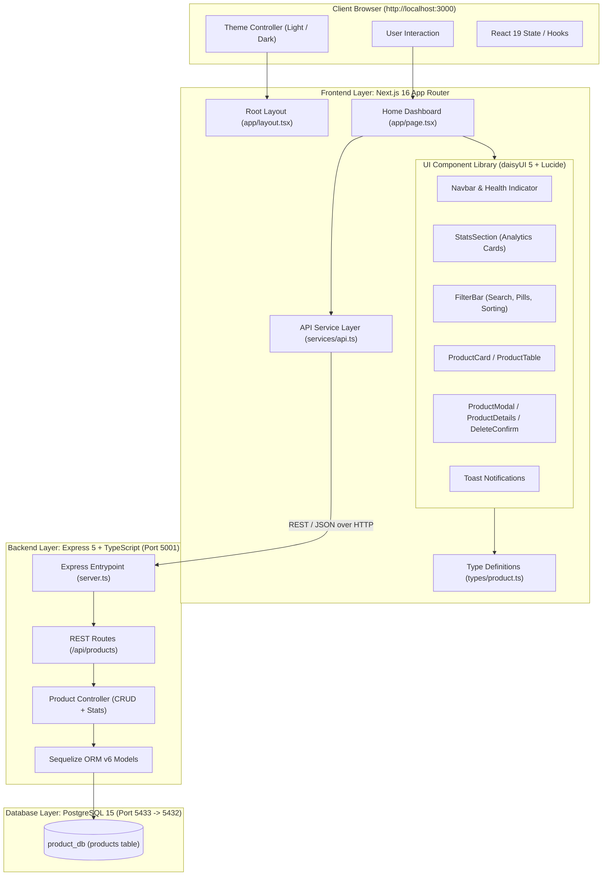

# Fullstack Project Setup & Creation Guide
*Complete Reference Manual for Backend (Express 5 + TypeScript + PostgreSQL) and Frontend (Next.js 16 + React 19 + Tailwind v4 + daisyUI 5)*

---

## 1. System Architecture & Component Diagram

This project is built as a fully decoupled, container-orchestrated fullstack web application:



---

## 2. Prerequisites & Global Tooling

Ensure the following runtimes and package managers are installed:

| Tool | Recommended Version | Check Command | Purpose |
| :--- | :--- | :--- | :--- |
| **Node.js** | `>= 20.x` or `22.x LTS` | `node -v` | Core JavaScript/TypeScript runtime |
| **npm** | `>= 10.x` | `npm -v` | Backend package manager |
| **pnpm** | `>= 9.x` or `11.x` | `pnpm -v` | Frontend package manager (disk-efficient & fast) |
| **Docker & Compose** | `>= 24.x` / Compose v2 | `docker compose version` | Multi-container runtime & database provisioning |

---

## 3. FRONTEND: How to Create & Configure From Scratch

This section covers the end-to-end process of building the Next.js 16 frontend application, including Tailwind CSS v4, daisyUI 5, types, API service layer, component architecture, and state management.

### 3.1 Initializing the Next.js 16 Project
From your project root directory (`/Users/mac/Desktop/workspace/product-app`), scaffold Next.js using `pnpm`:

```bash
pnpm create next-app frontend \
  --typescript \
  --eslint \
  --app \
  --src-dir=false \
  --import-alias="@/*" \
  --use-pnpm
```

### 3.2 Installing Dependencies
Navigate into the `frontend` directory and install the required dependencies:

```bash
cd frontend

# UI component library & Icons
pnpm install daisyui@^5.7.38 lucide-react@^1.46.0

# Tailwind CSS v4 & PostCSS engine
pnpm install -D tailwindcss@^4 @tailwindcss/postcss postcss
```

#### Complete `frontend/package.json` Configuration:
```json
{
  "name": "frontend",
  "version": "0.1.0",
  "private": true,
  "scripts": {
    "dev": "next dev",
    "build": "next build",
    "start": "next start",
    "lint": "eslint"
  },
  "dependencies": {
    "daisyui": "^5.7.38",
    "lucide-react": "^1.46.0",
    "next": "16.3.5",
    "react": "19.2.8",
    "react-dom": "19.2.8"
  },
  "devDependencies": {
    "@tailwindcss/postcss": "^4",
    "@types/node": "^20",
    "@types/react": "^19",
    "@types/react-dom": "^19",
    "eslint": "^9",
    "eslint-config-next": "16.3.5",
    "tailwindcss": "^4",
    "typescript": "^5"
  },
  "packageManager": "pnpm@11.1.1"
}
```

### 3.3 Next.js & Styling Configuration

#### A. `frontend/next.config.ts`
Enable standalone build output for optimized Docker image sizes:
```typescript
import type { NextConfig } from "next";

const nextConfig: NextConfig = {
  output: "standalone",
};

export default nextConfig;
```

#### B. `frontend/postcss.config.mjs`
Register the Tailwind v4 PostCSS plugin:
```javascript
export default {
  plugins: {
    "@tailwindcss/postcss": {},
  },
};
```

#### C. `frontend/app/globals.css`
In Tailwind CSS v4, configure styling and theme plugins directly inside CSS:
```css
@import "tailwindcss";
@plugin "daisyui" {
  themes: light --default, dark --prefersdark;
}
```

### 3.4 Complete Frontend File & Directory Structure
```
frontend/
├── app/
│   ├── favicon.ico
│   ├── globals.css              # Tailwind v4 import & daisyUI plugin config
│   ├── layout.tsx               # Root HTML shell, fonts & data-theme wrapper
│   └── page.tsx                 # Main interactive catalog & dashboard page
├── components/                  # 10 Reusable modular UI components
│   ├── Navbar.tsx               # Brand, theme toggle, health pill, action buttons
│   ├── StatsSection.tsx         # KPI analytics cards (Valuation, Units, Out-of-Stock)
│   ├── FilterBar.tsx            # Search input, category pill filters, sorting dropdown
│   ├── ProductCard.tsx          # Card view component for product items
│   ├── ProductTable.tsx         # Responsive zebra table view component
│   ├── ProductModal.tsx         # Add / Edit product modal with live image preview
│   ├── ProductDetailsModal.tsx  # Product specs, line valuation & timestamps modal
│   ├── DeleteConfirmModal.tsx   # Deletion confirmation dialog
│   ├── Pagination.tsx           # Page selector and items per page limit dropdown
│   └── Toast.tsx                # Floating notification alerts
├── services/
│   └── api.ts                   # Typed API service client communicating with backend
├── types/
│   └── product.ts               # Shared TypeScript schemas and response types
├── .env.example                 # Example environment variables template
├── .env.local                   # Local frontend runtime variables
├── Dockerfile                   # Development container configuration
├── Dockerfile.prod              # Multi-stage production container configuration
├── next.config.ts               # Next.js settings (standalone mode)
├── package.json                 # Dependencies & scripts
├── postcss.config.mjs           # PostCSS configuration
└── tsconfig.json                # TypeScript compiler configuration
```

---

### 3.5 TypeScript Definitions (`types/product.ts`)
Create `frontend/types/product.ts` to ensure strict typing across the client application:

```typescript
export interface Product {
  id: number;
  name: string;
  description: string | null;
  price: number;
  category: string;
  stock: number;
  imageUrl: string | null;
  sku: string | null;
  isActive: boolean;
  createdAt: string;
  updatedAt: string;
}

export interface ProductFormData {
  name: string;
  description: string;
  price: number | "";
  category: string;
  stock: number | "";
  imageUrl: string;
  sku: string;
  isActive: boolean;
}

export interface PaginationMeta {
  total: number;
  page: number;
  limit: number;
  totalPages: number;
  hasNextPage: boolean;
  hasPrevPage: boolean;
}

export interface ProductStats {
  totalProducts: number;
  activeProducts: number;
  inStock: number;
  outOfStock: number;
  totalUnits: number;
  totalInventoryValue: number;
  averagePrice: number;
}

export interface CategoryCount {
  category: string;
  productCount: number;
}

export interface ApiResponse<T> {
  success: boolean;
  data?: T;
  message?: string;
  errors?: string[];
  pagination?: PaginationMeta;
}

export interface FilterParams {
  search?: string;
  category?: string;
  minPrice?: number | "";
  maxPrice?: number | "";
  inStock?: boolean | "";
  isActive?: boolean | "";
  sortBy?: string;
  order?: "ASC" | "DESC";
  page?: number;
  limit?: number;
}
```

---

### 3.6 API Service Layer (`services/api.ts`)
Create `frontend/services/api.ts` to centralize all backend HTTP calls with error handling:

```typescript
import {
  ApiResponse,
  CategoryCount,
  FilterParams,
  PaginationMeta,
  Product,
  ProductFormData,
  ProductStats,
} from "@/types/product";

const API_BASE = process.env.NEXT_PUBLIC_API_URL || "http://localhost:5001/api";

// 1. Health Check with Timeout
export async function checkBackendHealth(): Promise<{ online: boolean; database: string }> {
  try {
    const controller = new AbortController();
    const timeoutId = setTimeout(() => controller.abort(), 2500);

    const res = await fetch(`${API_BASE}/health`, {
      signal: controller.signal,
      headers: { Accept: "application/json" },
    });
    clearTimeout(timeoutId);

    if (res.ok) {
      const data = await res.json();
      return { online: true, database: data.database || "unknown" };
    }
    return { online: false, database: "disconnected" };
  } catch {
    return { online: false, database: "disconnected" };
  }
}

// 2. Fetch Products with Filtering & Pagination
export async function fetchProducts(
  params: FilterParams = {}
): Promise<{ products: Product[]; pagination: PaginationMeta }> {
  const query = new URLSearchParams();

  if (params.search?.trim()) query.set("search", params.search.trim());
  if (params.category && params.category !== "All") query.set("category", params.category);
  if (params.minPrice !== undefined && params.minPrice !== "") query.set("minPrice", String(params.minPrice));
  if (params.maxPrice !== undefined && params.maxPrice !== "") query.set("maxPrice", String(params.maxPrice));
  if (params.inStock !== undefined && params.inStock !== "") query.set("inStock", String(params.inStock));
  if (params.isActive !== undefined && params.isActive !== "") query.set("isActive", String(params.isActive));
  if (params.sortBy) query.set("sortBy", params.sortBy);
  if (params.order) query.set("order", params.order);
  if (params.page) query.set("page", String(params.page));
  if (params.limit) query.set("limit", String(params.limit));

  const res = await fetch(`${API_BASE}/products?${query.toString()}`, { cache: "no-store" });
  if (!res.ok) throw new Error("Failed to fetch products");

  const json: ApiResponse<Product[]> = await res.json();
  return {
    products: json.data || [],
    pagination: json.pagination || {
      total: 0,
      page: 1,
      limit: 12,
      totalPages: 1,
      hasNextPage: false,
      hasPrevPage: false,
    },
  };
}

// 3. Fetch Category Aggregates
export async function fetchCategories(): Promise<CategoryCount[]> {
  const res = await fetch(`${API_BASE}/products/stats/categories`, { cache: "no-store" });
  if (!res.ok) return [];
  const json: ApiResponse<CategoryCount[]> = await res.json();
  return json.data || [];
}

// 4. Fetch Inventory Summary Stats
export async function fetchStats(): Promise<ProductStats | null> {
  const res = await fetch(`${API_BASE}/products/stats/summary`, { cache: "no-store" });
  if (!res.ok) return null;
  const json: ApiResponse<ProductStats> = await res.json();
  return json.data || null;
}

// 5. Create Product
export async function createProduct(payload: ProductFormData): Promise<Product> {
  const res = await fetch(`${API_BASE}/products`, {
    method: "POST",
    headers: { "Content-Type": "application/json" },
    body: JSON.stringify({
      ...payload,
      price: Number(payload.price),
      stock: Number(payload.stock),
      imageUrl: payload.imageUrl || null,
      sku: payload.sku || null,
    }),
  });
  if (!res.ok) {
    const err = await res.json().catch(() => ({}));
    throw new Error(err.message || "Failed to create product");
  }
  const json: ApiResponse<Product> = await res.json();
  return json.data!;
}

// 6. Update Product
export async function updateProduct(id: number, payload: Partial<ProductFormData>): Promise<Product> {
  const res = await fetch(`${API_BASE}/products/${id}`, {
    method: "PUT",
    headers: { "Content-Type": "application/json" },
    body: JSON.stringify({
      ...payload,
      price: payload.price !== undefined ? Number(payload.price) : undefined,
      stock: payload.stock !== undefined ? Number(payload.stock) : undefined,
    }),
  });
  if (!res.ok) {
    const err = await res.json().catch(() => ({}));
    throw new Error(err.message || "Failed to update product");
  }
  const json: ApiResponse<Product> = await res.json();
  return json.data!;
}

// 7. Delete Product
export async function deleteProduct(id: number): Promise<void> {
  const res = await fetch(`${API_BASE}/products/${id}`, { method: "DELETE" });
  if (!res.ok) throw new Error("Failed to delete product");
}

// 8. Seed Demo Products
export async function seedDemoProducts(): Promise<void> {
  const res = await fetch(`${API_BASE}/products/seed`, { method: "POST" });
  if (!res.ok) throw new Error("Failed to seed catalog");
}
```

---

### 3.7 Frontend UI Components Overview

The frontend includes 10 purpose-built components in `frontend/components/`:

| Component | File | Responsibilities & UI Features |
| :--- | :--- | :--- |
| **`Navbar`** | [`components/Navbar.tsx`](file:///Users/mac/Desktop/workspace/product-app/frontend/components/Navbar.tsx) | App branding, DaisyUI light/dark theme switch, real-time backend health indicator badge (`API Connected` / `Offline`), catalog seed button, and "+ Add Product" trigger. |
| **`StatsSection`** | [`components/StatsSection.tsx`](file:///Users/mac/Desktop/workspace/product-app/frontend/components/StatsSection.tsx) | Live dashboard KPI metric cards: Total Products, Active Catalog items, In-Stock ratio, Out-of-Stock warnings, Total Inventory Units, and Real-time Valuation ($). |
| **`FilterBar`** | [`components/FilterBar.tsx`](file:///Users/mac/Desktop/workspace/product-app/frontend/components/FilterBar.tsx) | Debounced search input (name, description, SKU), category badges with counts, price min/max filters, stock level selector, sort dropdown, and Grid/Table layout toggles. |
| **`ProductCard`** | [`components/ProductCard.tsx`](file:///Users/mac/Desktop/workspace/product-app/frontend/components/ProductCard.tsx) | Responsive card item with image fallback, category tag, SKU badge, stock progress badge, and View/Edit/Delete action triggers. |
| **`ProductTable`** | [`components/ProductTable.tsx`](file:///Users/mac/Desktop/workspace/product-app/frontend/components/ProductTable.tsx) | Compact zebra-striped table view for inventory scanning, active/inactive badge toggles, unit prices, stock counts, and row actions. |
| **`ProductModal`** | [`components/ProductModal.tsx`](file:///Users/mac/Desktop/workspace/product-app/frontend/components/ProductModal.tsx) | Dynamic Create/Edit modal with form validation, error highlighting, image URL live preview, price/stock number parsing, and submit state. |
| **`ProductDetailsModal`** | [`components/ProductDetailsModal.tsx`](file:///Users/mac/Desktop/workspace/product-app/frontend/components/ProductDetailsModal.tsx) | Full modal specification view displaying high-res image, SKU, category, price, stock, line valuation (`price * stock`), and created/updated timestamps. |
| **`DeleteConfirmModal`** | [`components/DeleteConfirmModal.tsx`](file:///Users/mac/Desktop/workspace/product-app/frontend/components/DeleteConfirmModal.tsx) | Safety modal to confirm product deletion and prevent accidental removal. |
| **`Pagination`** | [`components/Pagination.tsx`](file:///Users/mac/Desktop/workspace/product-app/frontend/components/Pagination.tsx) | Next/Previous page buttons, active page indicator, and items-per-page dropdown (12, 24, 48). |
| **`Toast`** | [`components/Toast.tsx`](file:///Users/mac/Desktop/workspace/product-app/frontend/components/Toast.tsx) | Floating bottom-right alert notifications with auto-dismiss timers for success and error messages. |

---

### 3.8 Root Layout (`app/layout.tsx`) & Main Page (`app/page.tsx`)

#### `app/layout.tsx`:
Configures the base HTML shell, fonts, and DaisyUI `data-theme="light"`:
```typescript
import type { Metadata } from "next";
import { Geist, Geist_Mono } from "next/font/google";
import "./globals.css";

const geistSans = Geist({ variable: "--font-geist-sans", subsets: ["latin"] });
const geistMono = Geist_Mono({ variable: "--font-geist-mono", subsets: ["latin"] });

export const metadata: Metadata = {
  title: "ProductHub - Product & Inventory Management",
  description: "Modern fullstack product catalog and inventory management system",
};

export default function RootLayout({ children }: { children: React.ReactNode }) {
  return (
    <html lang="en" data-theme="light" className={`${geistSans.variable} ${geistMono.variable} h-full antialiased`}>
      <body className="min-h-full flex flex-col">{children}</body>
    </html>
  );
}
```

#### `app/page.tsx` State Architecture:
1. **Health Check Cycle**: Runs `checkBackendHealth()` on mount and polls every 30 seconds.
2. **Debounced Search**: Defers search queries by 350ms to prevent request flood on typing.
3. **Data Refresh**: Triggers `fetchProducts()`, `fetchCategories()`, and `fetchStats()` concurrently using `Promise.all()`.
4. **Modal Controllers**: Manages open/close states for Create, Edit, Details, and Delete dialogs.

---

## 4. BACKEND: How to Create & Configure From Scratch

### 4.1 Initialize Project & Dependencies
```bash
mkdir backend
cd backend
npm init -y

# Dependencies
npm install express@^5.0.0 sequelize@^6.37.0 pg@^8.23.0 cors@^2.8.5 dotenv@^17.4.0

# Dev Dependencies
npm install -D typescript @types/node @types/express @types/cors @types/pg @types/dotenv tsx ts-node
```

### 4.2 Database Configuration (`src/config/database.ts`)
```typescript
import { Sequelize } from 'sequelize';
import dotenv from 'dotenv';

dotenv.config();

export const sequelize = new Sequelize(
  process.env.POSTGRES_DB || 'product_db',
  process.env.POSTGRES_USER || 'postgres',
  process.env.POSTGRES_PASSWORD || 'postgres',
  {
    host: process.env.POSTGRES_HOST || 'localhost',
    port: parseInt(process.env.POSTGRES_PORT || '5432', 10),
    dialect: 'postgres',
    logging: process.env.DB_LOGGING === 'true' ? console.log : false,
    pool: { max: 10, min: 0, acquire: 30000, idle: 10000 }
  }
);
```

### 4.3 Product Model (`src/models/Product.ts`)
```typescript
import { Model, DataTypes } from 'sequelize';
import { sequelize } from '../config/database';

export class Product extends Model {
  public id!: number;
  public name!: string;
  public description!: string;
  public price!: number;
  public category!: string;
  public stock!: number;
  public sku!: string;
  public imageUrl!: string;
  public isActive!: boolean;
}

Product.init(
  {
    id: { type: DataTypes.INTEGER, autoIncrement: true, primaryKey: true },
    name: { type: DataTypes.STRING(255), allowNull: false },
    description: { type: DataTypes.TEXT, allowNull: true },
    price: { type: DataTypes.FLOAT, allowNull: false },
    category: { type: DataTypes.STRING(100), allowNull: false },
    stock: { type: DataTypes.INTEGER, allowNull: false, defaultValue: 0 },
    sku: { type: DataTypes.STRING(50), allowNull: true, unique: true },
    imageUrl: { type: DataTypes.STRING(1024), allowNull: true },
    isActive: { type: DataTypes.BOOLEAN, allowNull: false, defaultValue: true },
  },
  { sequelize, tableName: 'products', timestamps: true }
);
```

### 4.4 Express Server Bootstrap (`src/server.ts`)
```typescript
import express from 'express';
import cors from 'cors';
import dotenv from 'dotenv';
import { sequelize } from './config/database';
import productRoutes from './routes/productRoutes';
import { errorHandler } from './middleware/errorHandler';

dotenv.config();

const app = express();
const PORT = process.env.PORT || 5001;

app.use(cors({ origin: process.env.CORS_ORIGIN || '*' }));
app.use(express.json());

app.use('/api/products', productRoutes);

app.get('/api/health', async (_req, res) => {
  try {
    await sequelize.authenticate();
    res.json({ status: 'ok', database: 'connected', timestamp: new Date() });
  } catch (error: any) {
    res.status(503).json({ status: 'degraded', database: 'disconnected', error: error.message });
  }
});

app.use(errorHandler);

sequelize.sync().then(() => {
  app.listen(PORT, () => {
    console.log(`Backend server running on http://localhost:${PORT}`);
  });
}).catch((err) => {
  console.error('Database connection error:', err);
});
```

---

## 5. Docker Orchestration

### Development Setup (`docker-compose.yml`)
Run all three containers with live file mount updates:
```yaml
services:
  product-db:
    image: postgres:15-alpine
    container_name: product-db
    restart: unless-stopped
    environment:
      POSTGRES_USER: ${POSTGRES_USER:-postgres}
      POSTGRES_PASSWORD: ${POSTGRES_PASSWORD:-postgres}
      POSTGRES_DB: ${POSTGRES_DB:-product_db}
    ports:
      - "${POSTGRES_PORT:-5433}:5432"
    volumes:
      - product-db-data:/var/lib/postgresql/data
    networks:
      - product-network
    healthcheck:
      test: ["CMD-SHELL", "pg_isready -U ${POSTGRES_USER:-postgres} -d ${POSTGRES_DB:-product_db}"]
      interval: 10s
      timeout: 5s
      retries: 5

  backend:
    build:
      context: ./backend
      dockerfile: Dockerfile
    container_name: product-backend
    restart: unless-stopped
    environment:
      PORT: 5001
      NODE_ENV: development
      POSTGRES_HOST: product-db
      POSTGRES_PORT: 5432
      POSTGRES_USER: ${POSTGRES_USER:-postgres}
      POSTGRES_PASSWORD: ${POSTGRES_PASSWORD:-postgres}
      POSTGRES_DB: ${POSTGRES_DB:-product_db}
    ports:
      - "5001:5001"
    volumes:
      - ./backend:/app
      - /app/node_modules
    depends_on:
      product-db:
        condition: service_healthy
    networks:
      - product-network

  frontend:
    build:
      context: ./frontend
      dockerfile: Dockerfile
    container_name: product-frontend
    restart: unless-stopped
    environment:
      NEXT_PUBLIC_API_URL: http://localhost:5001/api
    ports:
      - "3000:3000"
    volumes:
      - ./frontend:/app
      - /app/node_modules
      - /app/.next
    depends_on:
      - backend
    networks:
      - product-network

volumes:
  product-db-data:

networks:
  product-network:
    driver: bridge
```

### Production Setup (`docker-compose.prod.yml`)
Runs multi-stage lean containers with zero development dependencies:
```bash
docker compose -f docker-compose.prod.yml up --build -d
```

---

## 6. How to Run & Verify the Projects

### Running with Docker (Recommended)
```bash
# 1. Start stack
docker compose up -d

# 2. Seed catalog with demo data
docker compose exec backend npm run seed
```

### Running Locally on Host
```bash
# 1. Start PostgreSQL container
docker compose up product-db -d

# 2. Start Backend
cd backend
npm install
npm run dev
npm run seed

# 3. Start Frontend (separate terminal)
cd frontend
pnpm install
pnpm dev
```

### Verification Endpoints
- **Frontend Dashboard**: [http://localhost:3000](http://localhost:3000)
- **Backend Health Check**: [http://localhost:5001/api/health](http://localhost:5001/api/health)
- **Product Catalog API**: [http://localhost:5001/api/products](http://localhost:5001/api/products)
- **Inventory Summary API**: [http://localhost:5001/api/products/stats/summary](http://localhost:5001/api/products/stats/summary)
